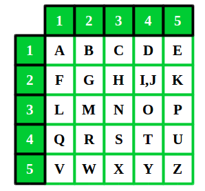
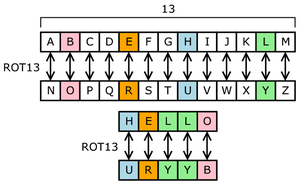

# Caesar Cipher
- The Caesar Cipher takes each letter in plaintext and replaces them by a fixed number of positions down the alphabet. 
    - Ex: **Gallifrey Stands** shifted 5 positions down results in **Lfqqnkwjd  Xyfsix**

- Project Requirements: 
    - If the *shift* number is not provided, less that -25, or greater than 25, the function will return false. 
    - Spaces should be maintained through out the program 
    - Capital Letters showed be ignored (Set to lowercase?)
    - If a letter is shifted so that it goes "off" the alphabet (e.g., a shift of 3 on the letter z), it should wrap around to the front of the alphabet (e.g., z becomes c).

- Possible Algorithm:
    - If larger than 26 - 26 = 0 or A 
    - If smaller than 0 + 26  or Z 
    - A cascading if. 

- Image Example: 

--- 
---
---

# Polybius Square
- The Polybius Square is a method for fractionating plaintext characters so they can be represented by smaller set of symbols. Each letter is represented by its coordinates in the grid. 
    - Ex: **May the Force be with You** results in **32 11 54 44 23 15 21 34 42 13 15 12 15 52 24 44 23 54 34 45**

- Project Requirements:
    - No Additional Symbols will be included as part of the input.
    - When Encoding the result must be a string
    - When Decoding the number of characters in the string 
    - Spaces should be maintained
    - Capital letters should be ignored
    - I and J share a space

- Possible Solution:
    - Multi Arrays
    - Objects
        - Letters to Numbers `[{A : 11}, {B : 12}, ...]`
        - Numbers to Letters `[{11 : A}, {12 : B}, ...]`

- Image Example:

--- 
---
---

# Substitution Cipher
- A monoalphabetical substitution cipher uses a fixed subsitution over the entire message. The ciphertext alphabet can be shifted, reversed, mixed or deranged of the plaintext alphabet.
    - Ex: **How do you want to do this** using a reversed alphabet results in **Sld wl blf dzmg gl wl gsrh**

- Project Requirements: 
    - The input could include spaces, letters, and special characters. 
    - Spaces should be maintained
    - The alphabet parameter must be a string exactly 26 characters long. Otherwise return `false`
    - All the characters in the alphabet must be unique. 

- Possible Solutions: 
    - Create an Array with the cipher alphabet
        - Find the current letter's index and swap it with the corresonding index in the cipher alphabet

- Image Example:

